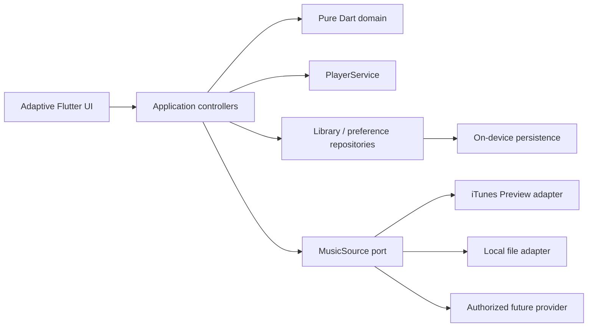

# 架构说明

## 技术选型

Flutter 提供同一套 Dart UI 和领域代码，并由官方工具生成 Windows、Linux、iOS、Android 原生宿主。项目采用 feature-first 目录，核心规则保持纯 Dart，便于跨平台测试和以后替换播放器或在线来源。

```text
lib/
├── app/                  # 主题、路由、响应式壳
├── core/                 # 错误、通用组件、设计 token
├── features/
│   ├── catalog/          # Song、标签器、MusicSource
│   ├── playback/         # 播放队列和跨平台 PlayerService
│   ├── library/          # 收藏、历史、本地导入
│   └── recommendations/  # 行为、偏好向量、排序与解释
└── main.dart
```

## 关键边界



网页结构或防护策略不进入领域层。第三方来源发生变化时只替换适配器。歌曲宝没有公开 API 且拒绝程序请求，因此仅通过系统浏览器执行用户可见的搜索，不承担媒体解析或下载。

## 推荐公式

对候选歌曲 `s`：

```text
score(s) = Σ preference(tag) × confidence(songTag)
         + freshnessBoost
         + popularityPrior
         - repetitionPenalty
         - artistSaturationPenalty
```

行为分值采用时间衰减。明确收藏/不喜欢的权重大于普通播放；早退只在播放时间足够判定为真实选择时计负反馈。推荐结果携带贡献最大的正向标签作为解释。

## 隐私与合规

- 行为、收藏和偏好默认仅存设备；
- 用户可以查看学习进度并一键重置；
- 不内置或上传用户音频；
- 下载能力由来源声明控制，预览 URL 不伪装为完整曲目；
- 新来源必须提供服务条款、授权范围、速率限制和稳定 API 文档后才能默认启用。
